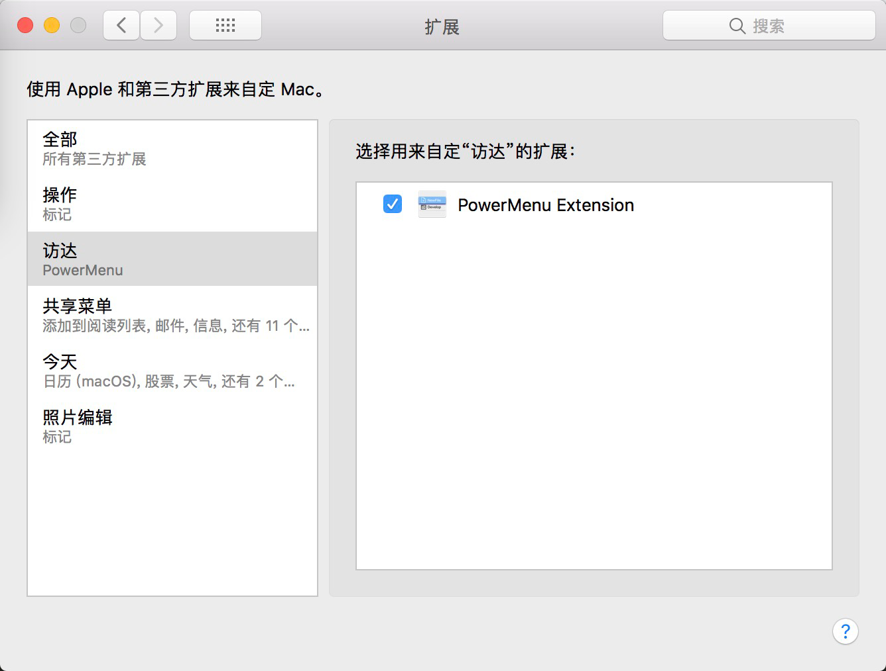
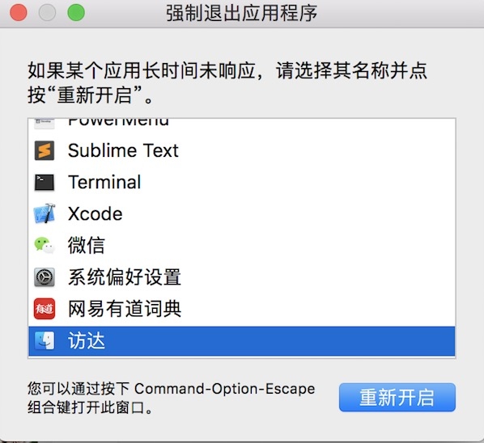
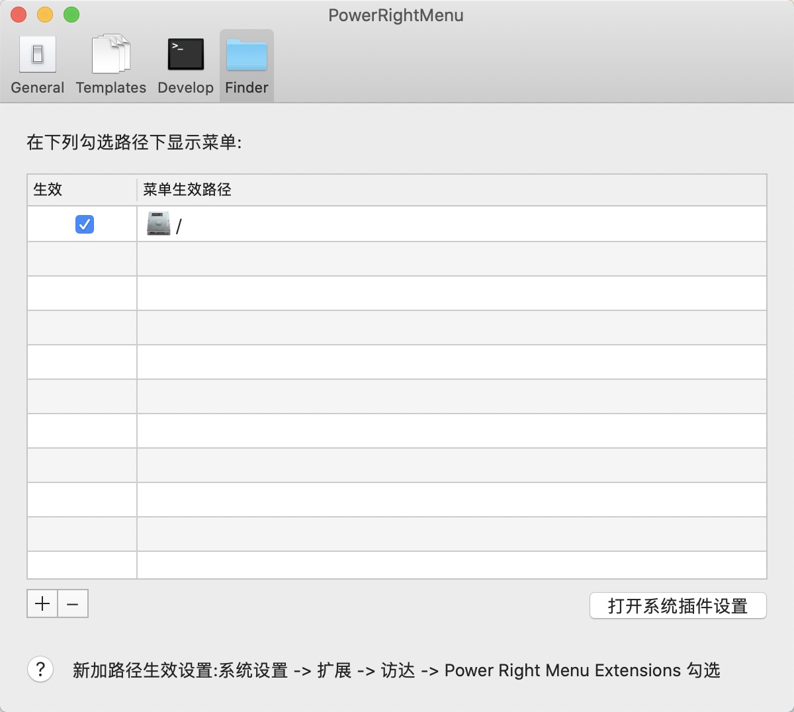

## PowerMenu 使用说明

### 1.怎么使菜单生效,显示? How to Make it Work?

1.打开 系统偏好设置 -> 扩展 -> 访达 -> 勾选 PowerMenu Extention   
（Open System Preference -> Extensions -> Finder -> Check PowerMenu Extention） 

  
### 2.菜单设置完,没更新? Menu Setting not Work ?

1.按快捷键 Command+Option+Escape  唤出强制退出应用程序菜单，选择 访达-> 重新开启 
(Press Shortcut Key “Command+Option+Escape” And ReOpen Finder) 

### 3.新添加的菜单使用路径，怎么生效呢? Add New Menu Path, How does it work ?
1.点击下方添加路径, 按快捷键 Command+Option+Escape  唤出强制退出应用程序菜单，选择 访达-> 重新开启 
(Click Add Button to Add Menu Paths ,Then Press Shortcut Key “Command+Option+Escape” And ReOpen Finder) 
